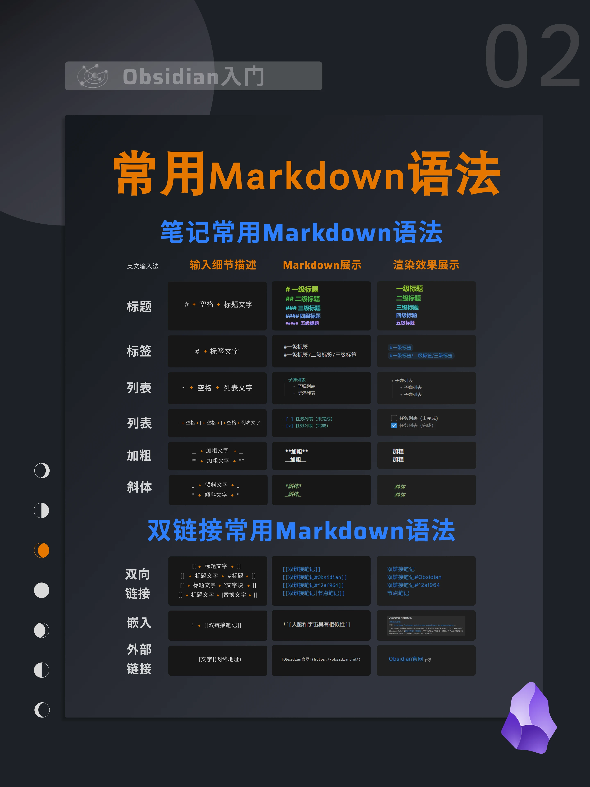

# 标题1

## 标题2

### 标题3

**这是一个要加粗的文字**

_这是要斜体的文字_

~~这是要删除的文字~~

> 这是要引用的句子
>
> > > 这是要引用的句子

**这是一个表格**

| 姓名 |  性别 |   分数 |
| -- | :-: | ---: |
| 小红 |  女  | 100分 |
| 小明 |  男  |  90分 |

_**这是一个单行代码**_

`printf("Hello World!")`

_**这是一个代码块**_

```java
int[] arr=new int[5];        // 动态数组初始化输入数据  
    Scanner sc = new Scanner(System.in);//创建键盘录入对象  
    for (int i = 0; i < arr.length; i++) {  
        arr[i]=sc.nextInt();  
    }    for (int i = 0; i < arr.length; i++) {  
        System.out.print(arr[i]+" ");
```

---

**无序列表**

- 条目1
- 条目2
- 条目3

**有序列表**

1. 条目1
2. 条目2
3. 条目3

[[markdown语法.png]]


```ad-warning
title: 注意
这是一条需要注意的信息

```


