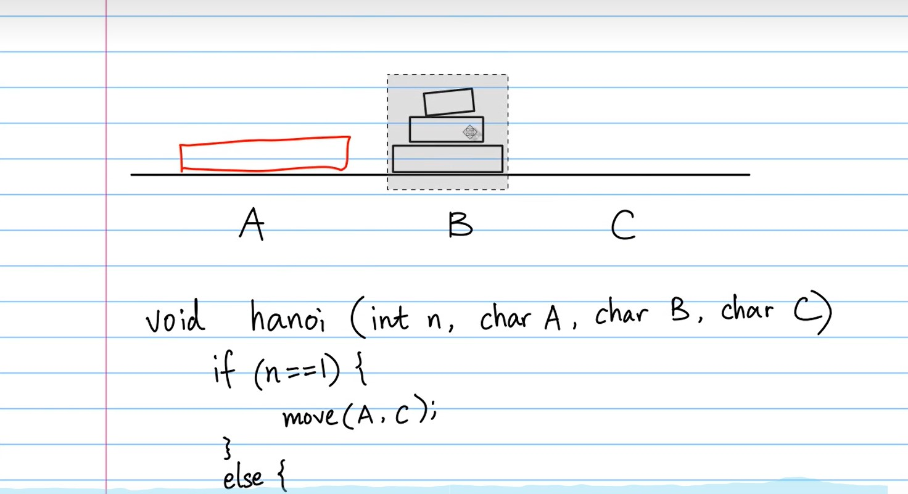

* 思想
	* 递归
**图示**
[[「递归练习」汉诺塔_哔哩哔哩_bilibili](https://www.bilibili.com/video/BV1dx411S7sY/?spm_id_from=333.999.0.0&vd_source=30d3e14399ca7c5e889670a30af532e1)]


***示例代码***
```java
public class Hanoi {  
    public static void main(String[] args) {  
        Hanoi(3, 'A', 'B', 'C');//A为起始柱，B为中间柱，C为目标柱  
    }  
  
    public static void Hanoi(int n, char A, char B, char C) {  
        if (n == 1) {                     //如果只有一个盘子，直接从A移动到C  
            System.out.println(A+"->"+C);//直接输出移动路径  
        } else {  
            Hanoi(n - 1, A, C, B);    //将A柱上的n-1个盘子借助C柱移动到B柱  
            System.out.println(A+"->"+C);//直接输出移动路径  
            Hanoi(n - 1, B, A, C);   //将B柱上的n-1个盘子借助A柱移动到C柱  
        }  
    }  
}
```
[「递归练习」汉诺塔_哔哩哔哩_bilibili](https://www.bilibili.com/video/BV1dx411S7sY/?spm_id_from=333.337.top_right_bar_window_default_collection.content.click&vd_source=30d3e14399ca7c5e889670a30af532e1)